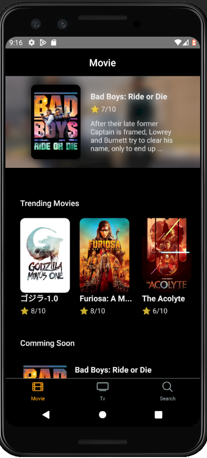
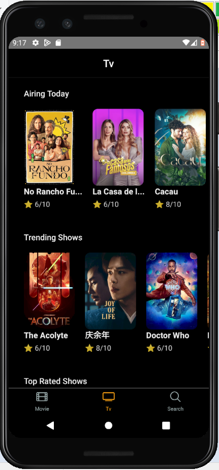

# Noovie

## Overview

Noovie is a sleek and intuitive mobile application built with React Native, designed for movie and series enthusiasts. Whether you're looking to keep track of upcoming releases, see what's trending, or simply watch trailers, Noovie has got you covered. This app is perfect for users who want to stay updated with the latest in the entertainment world, share their favorite finds with friends, and explore new content.





## Features

### 1. Upcoming Movies and Series

Stay ahead of the curve by checking out the latest upcoming movies and series. Get detailed information on release dates, cast, synopsis, and more. Never miss a premiere with Noovie's comprehensive list of forthcoming attractions.

### 2. Trending Movies and Series

Discover what's hot in the entertainment world. Noovie showcases the most popular and trending movies and series, so you always know what everyone is talking about. Stay in the loop with the latest trends and make sure your watchlist is always up to date.

### 3. Share Your Favorites

Found something you love? Share it with your friends and family! Noovie allows you to share your favorite movies and series directly from the app. Spread the word and enjoy discussions with your network about the latest releases.

### 4. Watch Trailers

Get a sneak peek of what's coming up by watching trailers. Noovie provides high-quality trailers for all upcoming and trending movies and series. Enjoy a quick preview before deciding what to watch next.

## Technical Details

- **Platform:** iOS and Android
- **Framework:** React Native
- **Backend:** TMDb (The Movie Database) API for fetching movie and series data
- **UI/UX:** Designed with a user-centric approach for seamless navigation and an engaging experience
- **Version Control:** GitHub for code management and collaboration

## Installation

1. Clone the repository:

   ```bash
   git clone https://github.com/yourusername/noovie.git
   ```

2. Navigate to the project directory:

   ```bash
   cd noovie
   ```

3. Install dependencies:

   ```bash
   npm install
   ```

4. Start the application:
   ```bash
   npx react-native run-android   # For Android
   npx react-native run-ios       # For iOS
   ```

## Contribution

Noovie is an open-source project, and we welcome contributions from the community. If you have ideas for new features, bug fixes, or improvements, feel free to submit a pull request. Let's make Noovie the go-to app for movie and series lovers together!

## License

This project is licensed under the MIT License. See the LICENSE file for more details.

## Contact

For any inquiries or feedback, please reach out to us at ccognate@gmail.com.

---

Explore, share, and stay updated with Noovie. Your ultimate companion for all things movies and series!
